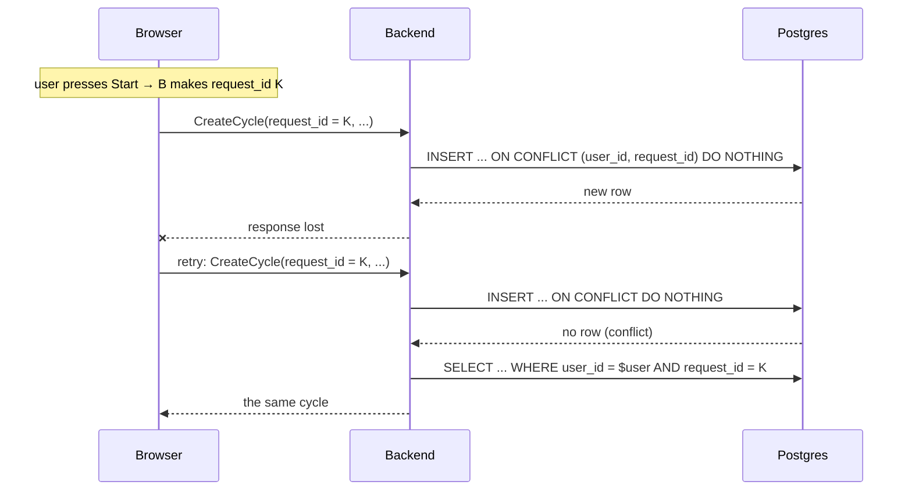

# Focus Ledger — API Design (v1, candidate list)

Status: draft. It lists candidate RPCs to keep, discard, or rename. The schema is in [`docs/schema.md`](schema.md).

Stack: Kotlin backend (gRPC), TypeScript web client (gRPC-Web), protobuf contract.

## Architecture

- **The server holds the data and the rules.** It stores every row and enforces every rule (cycle changes, moves, user isolation).
- **The browser computes the numbers.** It adds up cycles into totals, roll-ups, estimate progress, and reports. New report views then need no API change.
- **Sign-in is required in v1.** Guest accounts can come later: the account columns then drop `NOT NULL`.
- **The database generates every ID.** The client never makes one.
- **No BFF.** The browser calls the Kotlin backend directly over gRPC-Web. The backend holds every secret and gives the browser only an HttpOnly session cookie. That meets the goal of RFC 10017 (a browser app never holds a token) without a second server.

## Server stack

One Kotlin program, one port, no Spring:

- **Armeria** is the server on the public port. It serves gRPC and gRPC-Web for the browser, and the static files.
- **Ktor** runs inside the same program on an internal port. It hosts the MCP server with the official MCP Kotlin SDK. Armeria forwards `/mcp` to it.
- Both call the same core ledger service. The gRPC handlers and the MCP tools are thin adapters and hold no rules.

The first build step is a spike that proves three things: a browser gRPC-Web call to Armeria, an MCP tool call through the `/mcp` forward to Ktor, and the startup time on Cloud Run.

## Sessions

After `SignIn`, the server sets a signed, HttpOnly, `Secure`, `SameSite=Lax` cookie that holds `{user_id, expires_at}`. There is no session table. `Lax` sends the cookie on a top-level navigation from another site (an agent app opening `/oauth/authorize`), and not on a cross-site POST, so the gRPC-Web calls stay protected. The OAuth consent form carries its own CSRF token.

- The server checks the cookie's signature on every request. The signing key lives in the platform's secret store, never in the repository.
- The cookie expires after 30 days. When it is more than one day old, the next request gets a fresh 30-day cookie. A user who opens the app at least once every 30 days stays signed in.
- `SignOut` clears the cookie in that browser.
- Known limit: a copied cookie stays valid until it expires. "Sign out everywhere" can come later with a `session_version` column on `app_user`.

## User isolation

Every request acts only on the data of the user in the session. The implementation must keep these rules:

1. **The user comes from the session, never from the request.** One interceptor turns the session cookie into a `user_id` before any handler runs. No request message has a `user_id` field.
2. **Every query filters by that `user_id`.** A handler never reads or writes a row by its `id` alone. Example: `WHERE user_id = $session_user AND id = $node_id`.
3. **References stay inside one user.** The composite foreign keys (`(user_id, node_id) → node (user_id, id)`) make a cross-user reference fail in the database, even if a handler has a bug.
4. **Another user's ID gives `NOT_FOUND`.** The response is the same as for an ID that does not exist, so it reveals nothing.
5. **Tests prove it.** For every RPC, a test signs in as user B and uses an ID that belongs to user A. It expects `NOT_FOUND`, and it checks that A's data did not change.

## Conventions

- Package `focusledger.v1`. Service protos hold only the `service` and its `*Request` / `*Response` messages. Entities (`NodePb`, `CyclePb`, …) live in the model proto.
- Every RPC returns its own `*Response` message, even when it carries one entity. Then a field can be added later without a breaking change.
- Names are verb + noun. Standard verbs: `Get`, `List`, `Create`, `Update`. Domain verbs where the action has its own rules: `Move`, `Close`, `Start`, `Stop`.
- Every request is for the signed-in user. No request carries a `user_id`. The server takes it from the session.

## One service: `LedgerService`

All RPCs are in one gRPC service, `LedgerService`, served by one deployment. Nothing in the requirements needs more than one service. The proto groups the RPCs in the sections below. The Kotlin code keeps separate packages for account, ledger rules, and reports. Those are code boundaries, not service boundaries.

Split into more services only when a real trigger appears: a second team, a workload that must scale or fail on its own, or a public API.

## RPCs

10 RPCs in `LedgerService`, grouped by section. Each one earns its place. There is no RPC per screen and no RPC per action.

| Section | RPCs |
|---|---|
| Account | `SignIn`, `SignOut`, `GetAccount` |
| Settings | `GetSettings`, `UpdateSettings` |
| Nodes | `CreateNode`, `UpdateNode`, `ListNodes` |
| Cycles | `CreateCycle`, `UpdateCycle` |

Every `Update*` request carries a `google.protobuf.FieldMask` that names the fields to change. One request can change several fields: list each path in the mask, for example `["name", "estimates"]`. In proto3, a missing field and a zero value look the same, so the mask is the only way to tell them apart.

The mask is required. A missing or empty mask returns `INVALID_ARGUMENT`. This deviates from AIP-134, which treats a missing mask as "all populated fields". With explicit fields, that rule could silently reopen a node (`closed = false`) or clear its estimates.

### Account

`DeleteAccount` is not in v1. It returns before an iOS release, because Apple's App Store rules require in-app account deletion.

| RPC | Why it is required |
|---|---|
| `SignIn` | Checks the Google ID token, rejects an unverified email, finds or creates the user by email, and starts a session. |
| `SignOut` | Ends the session. JavaScript cannot clear an HttpOnly session cookie, so the server does it. |
| `GetAccount` | After a page reload, the app must know who is signed in. |

### Settings

| RPC | What it does |
|---|---|
| `GetSettings` | Returns the mode lengths, break length, sound, and notifications. |
| `UpdateSettings` | Changes the fields in the mask. The mask paths are the `SettingsPb` field names. A value outside its range, or an `*_UNSPECIFIED` enum in the mask, returns `INVALID_ARGUMENT`. `sound_enabled = false` is the Silent choice; `bell_sound` keeps the last real sound. |

### Nodes

A node carries its estimates and its cycles. There is no estimate RPC. There is no `GetNode` and no report RPC: every screen needs the whole tree for breadcrumbs and roll-ups, so `ListNodes` serves them all.

| RPC | What it does |
|---|---|
| `CreateNode` | Creates a node under a parent or at the root, with optional estimates (FR-1, FR-6, FR-7.2). |
| `UpdateNode` | Changes the fields in the mask: `name`, `parent_id` (move), `closed`, `estimates`. A move under the node's own descendant is rejected (FR-7.8). |
| `ListNodes` | Returns the user's tree for Today and the Tree screen. |

How the old actions map:

| Action | RPC |
|---|---|
| Rename | `UpdateNode`, mask `name` |
| Move | `UpdateNode`, mask `parent_id` |
| Close, reopen | `UpdateNode`, mask `closed` |
| Save an estimate | `UpdateNode`, mask `estimates` (replaces the three mode rows) |

### Cycles

| RPC | What it does |
|---|---|
| `CreateCycle` | Without `minutes`: starts a cycle (FR-2). A second running cycle is rejected. With `minutes`: writes a hand entry (FR-8). |
| `UpdateCycle` | Changes the fields in the mask: `minutes` (Stop, extension) or `node_id` (filing). |

How the old actions map:

| Action | RPC |
|---|---|
| Start | `CreateCycle`, no `minutes` |
| Hand entry | `CreateCycle`, with `minutes` |
| Stop | `UpdateCycle`, mask `minutes`. A stop under 1 minute sends 1. |
| Extend | `UpdateCycle`, mask `minutes` with the larger total |
| File an Inbox cycle | `UpdateCycle`, mask `node_id` |
| Pause | none. Pause lives in the UI. |

There is no delete. The server rejects a change that breaks the cycle rules: minutes set once and only grow, filing once, mode and start fixed.

### How the screens use `ListNodes`

| Screen | Call | The browser then computes |
|---|---|---|
| Today | `ListNodes(period = this week, include_closed = true)`, so closing a node changes no total | *Logged today* and today's totals (from today's cycles), the week's totals, the running cycle (the cycle with no `minutes`) |
| Today, estimate progress | `ListNodes()` (all time) | "3 of 8" per node, from its own cycles against its estimate |
| Tree | `ListNodes()` (all time) | the rolled-up `done / est` and time per row |
| Inbox | `ListNodes()` (all time) | the cycles of the node with no id |
| Report | `ListNodes(period = range, include_closed = true)` | the node × mode cross-tab, estimate vs actual, planned vs actual |

### Timer rules in the web app

- **Pause** keeps its paused time in browser storage, keyed by the cycle ID, so a reload does not count paused time as work. A pause over 10 minutes stops the cycle (FR-3.6).
- **Extension** on the bell runs an N-minute countdown. At its end, or on Stop, the app sends `UpdateCycle(minutes = logged + elapsed extension)`. It never writes minutes that were not worked. The extension start also lives in browser storage, so a reload resumes the countdown.

### Behavior the proto does not show

The proto is frozen. These rules are server behavior, not wire changes:
- `ListNodes` with `include_closed = false` leaves out closed nodes and every node under a closed node.
- `UpdateNodeResponse.node` carries no cycles. Read cycles with `ListNodes`.
- Every `ListNodes` call returns the user's running cycle, whatever its start time and the `period`, together with its node and that node's ancestors, even when they are closed and `include_closed = false`. So the client can always find the running cycle, and a Start never fails for a cycle it cannot see.

## Decisions

1. **Sign-in: Google only in v1.** `SignInRequest` holds a `oneof credential` with one field, `google_id_token`. A new provider is a new field in the `oneof`, so adding it is not a breaking change. Sign in with Apple needs a paid Apple Developer account, so it comes with the iOS app. No magic link.
2. **Roll-ups happen in the browser.** `ListNodes` returns nodes with their raw cycles. The browser computes the per-mode sums, the tree roll-up, today's and the week's totals, estimate progress, and planned vs actual. The backend has no stats messages and no roll-up query. When mobile apps arrive, their roll-up code must match the web's, or the logic moves to a shared library.
3. **CSV export (FR-11.6) is not in v1.** When it returns, it is a separate `ExportCycles`.
4. **Idempotency.** `CreateNode` and `CreateCycle` require a client `request_id`. A repeat returns the existing row and creates nothing. See "Idempotency" below.
5. **The browser sends periods, not a time zone.** It computes "today", "this week" (starting Monday), and report ranges in its own zone, and sends them as UTC `[start, end)` timestamps. The server needs no time-zone logic.

## Idempotency

A network retry must never log a cycle or create a node twice. The design follows Google's [AIP-155](https://google.aip.dev/155). The storage is in `schema.md`, "Idempotency".



**The client:**
1. Makes a random UUID (version 4) when the user acts: presses Start, saves a hand entry, or creates a node.
2. Sends that UUID as `request_id`, and keeps it until a response arrives.
3. On a network error or a timeout, retries with the **same** `request_id`.
4. Makes a new UUID for the next action.

**The server, for `CreateNode` and `CreateCycle`:**
1. Rejects a missing or malformed `request_id` with `INVALID_ARGUMENT`.
2. Runs `INSERT ... ON CONFLICT (user_id, request_id) DO NOTHING RETURNING *`, with `user_id` from the session.
3. If a row comes back, returns it.
4. If no row comes back, reads the row by `(user_id, request_id)` and returns it. The row may have changed since the first request (a Stop, an extension, a filing, a rename), so the server compares only the fields that never change. For a cycle: `mode` and `planned_minutes`, and for a hand entry also `started_at`. If one differs, it returns `INVALID_ARGUMENT` ("request_id was already used for a different request"). A node has no field that never changes, so a `CreateNode` repeat returns the row with no comparison.
5. Treats a Start (`CreateCycle` without `minutes`) the same way: a retried Start returns the running cycle, and a new Start with a new key while one runs still fails with `FAILED_PRECONDITION`.

**Updates** need no key. Each sends an absolute value, so a repeat gives the same result: Stop sends the minutes, an extension sends the new total (for example 65, never "+15"), and filing sends the node.

**Tests** (in the backend PR that builds the creates):
- A repeat with the same key returns the same row, and the table holds one row.
- Two concurrent requests with the same key create one row.
- The same key with different content returns `INVALID_ARGUMENT`.
- The same key from two users creates two rows.
- A missing key returns `INVALID_ARGUMENT`.

## Request and response messages

This section holds the full proto contract, for review here. The `.proto` files follow in a later PR, after the design is agreed. Package: `focusledger.v1`.

Nullable values use proto3 `optional`, so the server can tell "not set" from zero:
- `CyclePb.minutes` unset means running.
- `CyclePb.node_id` unset means Inbox.
- `NodePb.parent_id` unset means a root.

### The service

```protobuf
// Every RPC acts for the signed-in user from the session. No request carries a user ID.
service LedgerService {
  // Account
  rpc SignIn(SignInRequest) returns (SignInResponse);
  rpc SignOut(SignOutRequest) returns (SignOutResponse);
  rpc GetAccount(GetAccountRequest) returns (GetAccountResponse);

  // Settings
  rpc GetSettings(GetSettingsRequest) returns (GetSettingsResponse);
  rpc UpdateSettings(UpdateSettingsRequest) returns (UpdateSettingsResponse);

  // Nodes
  rpc CreateNode(CreateNodeRequest) returns (CreateNodeResponse);
  rpc UpdateNode(UpdateNodeRequest) returns (UpdateNodeResponse);
  rpc ListNodes(ListNodesRequest) returns (ListNodesResponse);

  // Cycles
  rpc CreateCycle(CreateCycleRequest) returns (CreateCycleResponse);
  rpc UpdateCycle(UpdateCycleRequest) returns (UpdateCycleResponse);

}
```

### Shared messages (`model.proto`)

```protobuf
enum FocusMode {
  FOCUS_MODE_UNSPECIFIED = 0;
  FOCUS_MODE_DEEP_FOCUS = 1;
  FOCUS_MODE_EXECUTION = 2;
  FOCUS_MODE_SHALLOW = 3;
}

// A time range [start, end). The browser computes it in the user's zone and sends it in UTC.
message PeriodPb {
  google.protobuf.Timestamp start = 1;
  google.protobuf.Timestamp end = 2;
}

message AccountPb {
  string id = 1;
  string email = 2;
  google.protobuf.Timestamp created_at = 3;
}

enum BellSound {
  BELL_SOUND_UNSPECIFIED = 0;
  BELL_SOUND_BOWL = 1;
  BELL_SOUND_WOOD = 2;
  BELL_SOUND_CHIME = 3;
}

enum FocusSound {
  FOCUS_SOUND_UNSPECIFIED = 0;
  FOCUS_SOUND_NONE = 1;
  FOCUS_SOUND_TICKING_FAST = 2;
  FOCUS_SOUND_TICKING_SLOW = 3;
  FOCUS_SOUND_WHITE_NOISE = 4;
  FOCUS_SOUND_BROWN_NOISE = 5;
}

message SettingsPb {
  int32 deep_focus_minutes = 1;
  int32 execution_minutes = 2;
  int32 shallow_minutes = 3;
  int32 break_minutes = 4;
  bool sound_enabled = 5;
  bool notifications_enabled = 6;
  int32 long_break_minutes = 7;
  reserved 8;
  BellSound bell_sound = 9;
  int32 bell_volume = 10;
  int32 bell_repeat = 11;
  bool ring_after_break = 12;
  FocusSound focus_sound = 13;
  int32 focus_sound_volume = 14;
}

message EstimatePb {
  FocusMode mode = 1;
  int32 cycle_minutes = 2;
  int32 cycle_count = 3;
}

message CyclePb {
  string id = 1;
  // Unset means the cycle is in the Inbox.
  optional string node_id = 2;
  FocusMode mode = 3;
  google.protobuf.Timestamp started_at = 4;
  int32 planned_minutes = 5;
  // Unset means the cycle is running.
  optional int32 minutes = 6;
}

// The Inbox is returned as a node with no id and no name. Its cycles have no node_id.
message NodePb {
  string id = 1;
  // Unset means a root node.
  optional string parent_id = 2;
  string name = 3;
  bool closed = 4;
  repeated EstimatePb estimates = 5;
  // The node's own cycles inside the requested period. Descendants' cycles are on their own nodes.
  repeated CyclePb cycles = 6;
  google.protobuf.Timestamp created_at = 7;
}
```

### Account messages

#### `SignIn`

```protobuf
message SignInRequest {
  oneof credential {
    string google_id_token = 1;
  }
}

// The session is set as an HttpOnly cookie, not returned in the body.
message SignInResponse {
  AccountPb account = 1;
}
```

#### `SignOut`

```protobuf
message SignOutRequest {}

message SignOutResponse {}
```

#### `GetAccount`

```protobuf
message GetAccountRequest {}

message GetAccountResponse {
  AccountPb account = 1;
}
```

### Settings messages

#### `GetSettings`

```protobuf
message GetSettingsRequest {}

message GetSettingsResponse {
  SettingsPb settings = 1;
}
```

#### `UpdateSettings`

```protobuf
message UpdateSettingsRequest {
  SettingsPb settings = 1;
  google.protobuf.FieldMask update_mask = 2;
}

message UpdateSettingsResponse {
  SettingsPb settings = 1;
}
```

### Nodes messages

#### `CreateNode`

```protobuf
message CreateNodeRequest {
  // Required UUID, made by the client per action. A repeat returns the existing node.
  string request_id = 1;
  optional string parent_id = 2;
  string name = 3;
  repeated EstimatePb estimates = 4;
}

message CreateNodeResponse {
  NodePb node = 1;
}
```

#### `UpdateNode`

```protobuf
// Paths in update_mask: "name", "parent_id", "closed", "estimates".
// "parent_id" in the mask with parent_id unset moves the node to the root.
// "estimates" replaces all of the node's estimate rows.
message UpdateNodeRequest {
  string node_id = 1;
  optional string parent_id = 2;
  string name = 3;
  bool closed = 4;
  repeated EstimatePb estimates = 5;
  google.protobuf.FieldMask update_mask = 6;
}

message UpdateNodeResponse {
  NodePb node = 1;
}
```

#### `ListNodes`

```protobuf
// Returns the whole tree in one response, with no pagination. The client computes
// all totals and roll-ups from the cycles.
message ListNodesRequest {
  bool include_closed = 1;
  // Only cycles that started inside this period are returned. Unset means all time.
  PeriodPb period = 2;
}

message ListNodesResponse {
  repeated NodePb nodes = 1;
}
```

### Cycles messages

#### `CreateCycle`

```protobuf
// Without minutes: starts a cycle now. The server rejects a second running cycle.
// With minutes and started_at: writes a hand entry.
message CreateCycleRequest {
  // Required UUID, made by the client per action. A repeat returns the existing cycle.
  string request_id = 1;
  optional string node_id = 2;
  FocusMode mode = 3;
  int32 planned_minutes = 4;
  google.protobuf.Timestamp started_at = 5;
  optional int32 minutes = 6;
}

message CreateCycleResponse {
  CyclePb cycle = 1;
}
```

#### `UpdateCycle`

```protobuf
// Paths in update_mask: "minutes" (Stop or extension; minutes can only grow)
// and "node_id" (filing an Inbox cycle, once).
message UpdateCycleRequest {
  string cycle_id = 1;
  optional int32 minutes = 2;
  optional string node_id = 3;
  google.protobuf.FieldMask update_mask = 4;
}

message UpdateCycleResponse {
  CyclePb cycle = 1;
}
```

## Errors

| gRPC status | When |
|---|---|
| `UNAUTHENTICATED` | No valid session, or a `SignIn` token that fails the checks or has an unverified email. |
| `INVALID_ARGUMENT` | A field is missing or out of range. Examples: an empty name, minutes outside 1–1440, an unknown path in `update_mask`, a missing or empty `update_mask`, a missing `request_id`, a `request_id` reused for a different request. |
| `NOT_FOUND` | The node or cycle does not exist for this user. Another user's ID also gives `NOT_FOUND`, so the response does not reveal that the ID exists. |
| `FAILED_PRECONDITION` | A rule rejects the change: a second running cycle, minutes that go down, re-filing a filed cycle, a move under the node's own descendant. |
