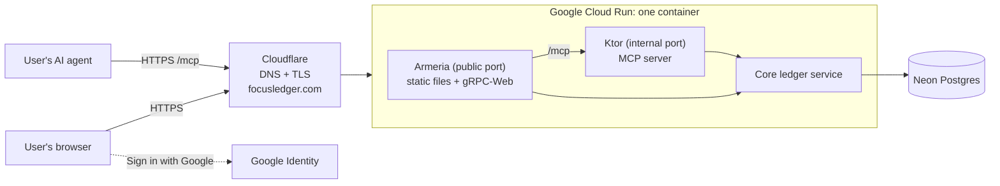
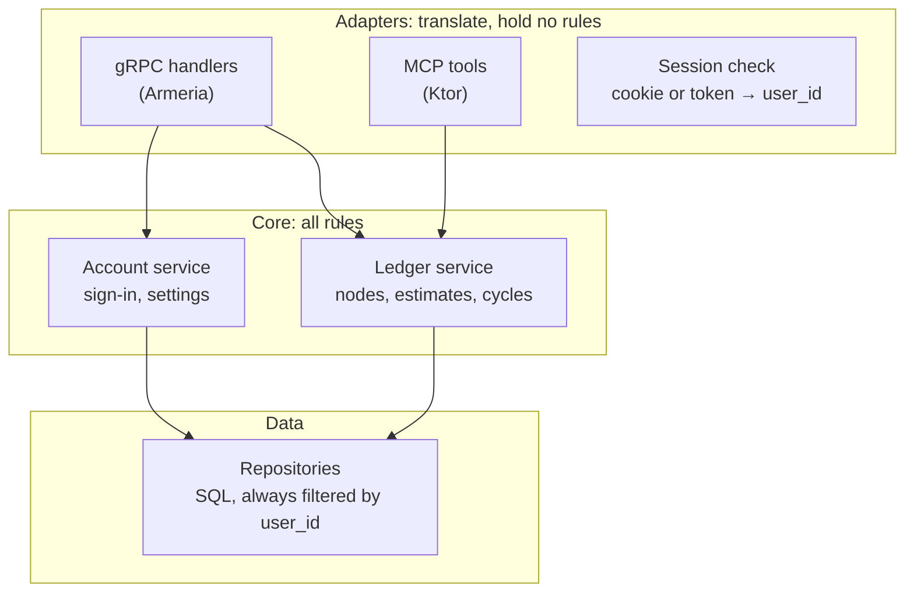
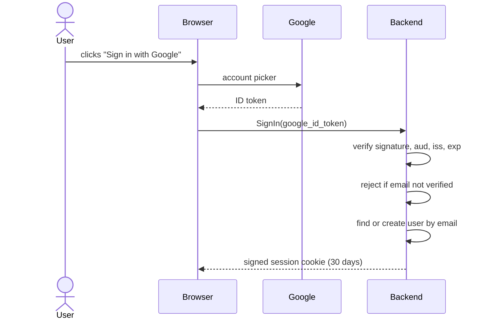

# Focus Ledger — Architecture (v1)

Status: draft for review. The schema is in [`schema.md`](schema.md). The API, sessions, and user-isolation rules are in [`api.md`](api.md).

Focus Ledger is one Kotlin program, one Postgres database, and one domain. The browser and AI agents both reach the same program. The program holds the data and the rules. The browser computes the numbers.

## The big picture

| Part | What it is | Where it runs |
|---|---|---|
| Domain, DNS, TLS | `focusledger.com` | Cloudflare (registrar and DNS) |
| Public pages | Landing page, blog, pricing. Pre-rendered HTML, so search engines can read them. | Static files, served by Armeria |
| Web app | React + TypeScript, under `/app` | Static files, served by Armeria |
| Backend | One Kotlin program: Armeria + Ktor + the core | Cloud Run, one container, scales to zero |
| Database | Postgres | Neon |
| Sign-in | Google ID token, checked by the backend | Google |

## One domain, split by path

| Path | Serves |
|---|---|
| `/`, `/features`, `/pricing`, `/blog/...` | Public pages |
| `/app/...` | The web app |
| `/focusledger.v1.LedgerService/...` | The gRPC-Web API |
| `/mcp` | The MCP server for AI agents |

One origin means the session cookie works everywhere and no CORS setup is needed. Visitors who arrive from search stay on the same domain when they sign in.

## Inside the backend

- **Adapters** translate between a protocol and the core. The gRPC handlers speak protobuf. The MCP tools speak MCP, resolve node names to IDs, convert time zones, and compute summaries for agents.
- **The core** holds every rule: the three allowed cycle changes, moves, estimates, and sign-in. Both adapters call the same core functions, so a rule is written once.
- **The data layer** holds the SQL. Every query takes the `user_id` from the session.

**Server stack:** Armeria is the server on the public port. It serves the static files and gRPC-Web. Ktor runs in the same program on an internal port and hosts the MCP server with the official MCP Kotlin SDK. Armeria forwards `/mcp` to Ktor. There is no Spring and no BFF.

## Where the numbers are computed

The backend returns rows. The browser computes every total and roll-up from the cycles that `ListNodes` returns: per-mode sums, the tree roll-up, today's and the week's totals, estimate progress, and planned vs actual. New report views then need no API change.

The MCP layer computes summaries in Kotlin for agents, on top of the same `ListNodes` logic, because agents should receive finished numbers.

## Key flows

**Sign-in**

**Opening Today**
1. The browser calls `ListNodes(period = this week)` and `ListNodes()` (all time) in parallel.
2. The backend returns nodes with their cycles. The database work is about 1 ms.
3. The browser computes *Logged today*, today's and the week's totals, the running cycle, and estimate progress.

**Start and Stop**
1. The browser makes a `request_id` for the press of Start. `CreateCycle` without `minutes` writes the running row. A retry with the same `request_id` returns that row. The database rejects a second running cycle for the same user.
2. The browser runs the countdown and pause.
3. `UpdateCycle` with mask `minutes` stops the cycle. A stop under 1 minute sends 1. The database trigger rejects any other change.

**An agent logs work**
1. The agent calls the MCP tool `log_cycle` with a node path, a mode, a start time, and minutes.
2. Ktor turns the OAuth token into a `user_id`. The tool resolves the path to a node ID and calls the same core function as `CreateCycle`, with a `request_id` (the agent's, or one the tool makes for the call).
3. The tool returns one short confirmation line.

## Cross-cutting rules

| Area | Design | Detail in |
|---|---|---|
| Sessions | Signed, HttpOnly, `SameSite=Strict` cookie, 30 days, renewed on use. No session table. | `api.md` → Sessions |
| User isolation | The user comes from the session or token. Every query filters by it. Composite foreign keys block cross-user references. | `api.md` → User isolation |
| Time | UTC everywhere. The browser sends UTC ranges. MCP tools take a `time_zone`. | `schema.md` → decision 4 |
| Idempotency | `CreateNode` and `CreateCycle` require a client-made `request_id`. `UNIQUE (user_id, request_id)` on `ledger.node` and `ledger.cycle` makes a retry insert nothing, and the server returns the existing row. | `api.md` → Idempotency, `schema.md` → Idempotency |
| CSRF and CORS | One origin, so no CORS. `SameSite=Strict` cookies block cross-site requests. | this doc |
| Rate limits | Per session and per MCP token. Stricter on `SignIn`. | to build |

## Hosting and cost

| Part | Service | Cost now | Paid when |
|---|---|---|---|
| Domain | Cloudflare Registrar | about $10.44 a year for .com ($11.15 from Nov 1, 2026) | always |
| DNS, TLS, caching | Cloudflare free plan | $0 | not expected |
| Backend | Cloud Run | $0 up to 2M requests, 180,000 vCPU-seconds, and 360,000 GB-seconds a month | about 1,600 daily active users (estimate: about 40 requests per user per day) |
| Database | Neon free plan | $0 up to 0.5 GB and 100 compute-hours a month | about 1,000 or more user-years of data |
| CI | GitHub Actions | $0 for public repositories | not expected |

Services that were rejected:
- Render free: the free Postgres is deleted after 30 days, and a sleeping service takes about a minute to wake.
- Supabase free: it pauses a project after 7 days without activity.
- Vercel Hobby: non-commercial use only.
- Oracle Always Free: it halved its free VM in June 2026 without notice.

Cloud Run and Neon both sleep when idle. The first request after a quiet period waits for the program to start and the database to wake. A GraalVM native image shortens the start, and it is free.

## Open source and self-hosting

The whole system is one container plus Postgres. A self-hoster runs `docker compose up`. Security does not depend on hidden code: it comes from the session check, user isolation, rate limits, and input validation.

## Open items

1. **MCP design:** in [`mcp.md`](mcp.md). Open: built-in OAuth, and whether MCP is in v1.
2. **The spike:** prove a browser gRPC-Web call, an MCP call through the `/mcp` forward (including a streamed response), and the cold-start time on Cloud Run.
