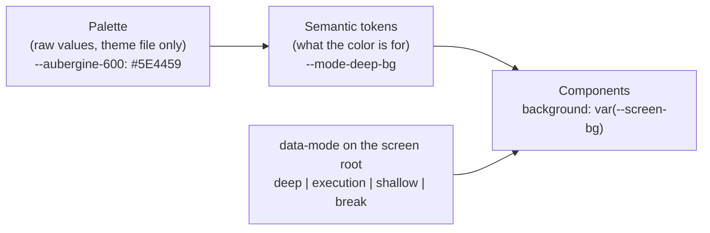

# Theming

The owner will add themes later. To make a theme a data change only, every color in the web app comes from a named token, and a theme is one file that gives each token a value.

## The rule

- A component never writes a color value. It writes `var(--token-name)`.
- Only files in `web/src/theme/` contain color values: hex, `rgb()`, `rgba()`, `hsl()`, or a named color such as `white`.
- A test fails the build if a color value appears anywhere else in `web/src` (CSS, TSX, inline `style`, and SVG `fill` or `stroke`). SVG icons use `currentColor`.
- Two places that show the same thing use the same token. Two places that only happen to share a value today use two tokens.

To swap color X for color Y, change one value in a theme file. To add a theme, add one file.

## Token layers

1. **Palette** (inside a theme file only): named raw values, for example `--aubergine-600`. Components never read a palette token.
2. **Semantic tokens** (defined in the theme file from the palette): named by purpose. Components read only these.
3. **Mode scope**: the screen root carries `data-mode`. A small shared stylesheet maps `--screen-bg`, `--screen-on`, and the other `--screen-*` tokens to the matching mode tokens. A component on the Start, Running, Bell, or Break screen reads `--screen-*` and never names a mode.

Alpha steps of white or ink are tokens too (`--on-screen-muted`, `--ink-faint`), never inline `rgba()`.

## Semantic tokens

The values come from the boards in `browser-v2/`. The builder reads each value from the boards and records it in the default theme. This table fixes the names and the purpose.

| Group | Tokens | Used for |
|---|---|---|
| Mode screens | `--mode-{deep,execution,shallow,break}-bg` | The full-screen background of Start, Running, Bell, and Break |
| On a mode screen | `--on-screen`, `--on-screen-strong`, `--on-screen-muted`, `--on-screen-faint`, `--on-screen-plate`, `--on-screen-rule`, `--on-screen-outline`, `--screen-glow` | Text, selected-row plate, divider, button outline, top glow on mode screens |
| Primary button on a mode screen | `--screen-cta-bg`, `--screen-cta-fg` | START and PAUSE (the label takes the screen color) |
| Mode marks | `--mode-{deep,execution,shallow}-mark` | The small bar or dot that names a mode on light surfaces (picker, tasks, task page) |
| Page | `--paper`, `--panel`, `--ink`, `--ink-strong`, `--ink-muted`, `--ink-faint`, `--rule`, `--row-hover` | The Tasks and task pages |
| Dialog | `--dialog-bg`, `--dialog-header-bg`, `--dialog-fg`, `--dialog-muted`, `--dialog-rule`, `--dialog-selected`, `--scrim`, `--dialog-shadow` | Task picker, bell, new task, edit task |
| Accent | `--accent`, `--accent-on` | New task pill, links, primary button in a dialog (today the Deep Focus aubergine) |
| State | `--over-estimate`, `--focus-ring` | An estimate that the logged time passed; the keyboard focus ring |
| Chart | `--chart-1` … `--chart-6`, `--chart-other` | The "How it splits" ring. Never a mode color. |

A builder who needs a token that is not in this table adds it with a purpose-based name and lists it in the PR description.

## Themes

- `web/src/theme/default.css` holds the palette and the semantic tokens on `:root`.
- A future theme is `web/src/theme/<name>.css`, scoped to `:root[data-theme="<name>"]`, and redefines semantic tokens only.
- Dark mode is a theme like any other.
