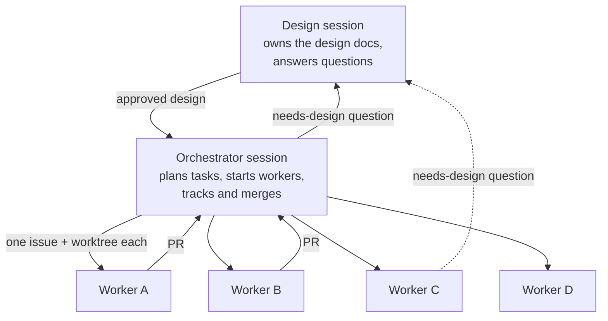

# Focus Ledger — Execution Plan (v1)

Status: draft for review. Everything in this doc is **proposed** until approved. Setup details are in [`setup.md`](setup.md).

The goal: get the first working version out fast by running several Claude Code sessions in parallel. Parallel work is possible only when the contracts between the parts are fixed first. So the plan has one short serial phase, then parallel workstreams.

## The contracts that make parallel work possible

| Contract | Between | Where |
|---|---|---|
| The `.proto` files | Web app ↔ backend | `proto/` (from `api.md`) |
| The schema (`V1__init.sql`) | Backend ↔ database | `backend/data/.../V1__init.sql` (from `schema.md`) |
| The core service interfaces | gRPC handlers ↔ MCP tools ↔ core | `backend/core/` (written in Phase 0) |

A worker session never changes a contract on its own. A contract change is a question for the design session (see "Orchestration").

## Phase 0: foundation (serial, one session)

Phase 0 unblocks everything else. It runs in one session, in this order:

1. **Repo scaffold.** The Gradle build with the modules from `setup.md`, `docker-compose.yml`, `.env.example`, the license, a README.
2. **Contracts into the repo.** The `.proto` files and code generation for Kotlin and TypeScript. `V1__init.sql` with the roles and grants. Flyway runs it against local Postgres.
3. **Core service interfaces.** The Kotlin interfaces for the ledger and account services, with their input and output types, and no implementation yet. With these, the backend, MCP, and test work can proceed side by side.
4. **CI skeleton.** GitHub Actions: build, `buf lint`, and the tests, on every PR.
5. **The spike.** Prove three things, and write the results in the PR:
    1. A browser gRPC-Web call reaches Armeria.
    2. An MCP tool call works through the Armeria `/mcp` forward to Ktor, including a streamed response.
    3. The cold-start time on Cloud Run, as a normal JVM and as a GraalVM native image.

Phase 0 ends when all five are merged and CI is green. If the spike fails on item 2, the design session decides the fallback before Phase 1 starts.

## Phase 1: parallel workstreams

| Workstream | Builds | Depends on | Can start |
|---|---|---|---|
| **A. Backend core + gRPC** | The core services, jOOQ repositories, the 10 RPCs, Google sign-in and session cookies, user-isolation tests | Phase 0 | right after Phase 0 |
| **B. Web app** | Sign-in, Today, the running timer, the Tree, the Report, Settings, the roll-up code in TypeScript | Phase 0 (the generated TypeScript client) | right after Phase 0. It develops against a fake `LedgerService` that returns fixed data, then switches to the real backend at integration. |
| **C. Infra + deploy** | The Google Cloud project, service accounts, Workload Identity Federation, Secret Manager, Neon with the two roles, the Cloudflare domain, the CI deploy job | Phase 0 | right after Phase 0 |
| **D. MCP with personal access tokens** | The Ktor MCP server, the 8 tools, the Kotlin summaries, personal access tokens | The core interfaces (Phase 0). The tools call A's implementations once they land. | right after Phase 0 |
| **E. MCP OAuth + security review** | OAuth 2.1 from `mcp.md`, the `agent_grant` table, the attack-case tests, rate limits, a review of the whole system against the security rules | D | after D |

**Integration** connects the web app to the real backend on a deployed environment. **The launch checklist** covers error tracking, an uptime monitor, database backups, and a final pass of the user-isolation tests.

## Orchestration

Three kinds of Claude Code sessions work together:

| Role | Does | Does not |
|---|---|---|
| **Design session** (the session that wrote these docs) | Owns `docs/`. Answers `needs-design` questions. Approves every contract change. | Write feature code |
| **Orchestrator session** | Turns this plan into GitHub issues. Creates one git worktree and branch per workstream. Starts a worker session for each. Tracks progress, reviews PRs, decides merge order, runs integration checks. | Change the design on its own |
| **Worker session** | Builds one workstream in its own worktree. Opens one PR per task. Follows `CLAUDE.md`. | Change `proto/`, the schema, or the core interfaces. Merge its own PR. Deploy. |

### GitHub is the shared record

Sessions can end at any time, so every piece of state lives on GitHub, not in a session's memory.

- **One issue per task**, labeled with its workstream (`ws:A` … `ws:E`). The issue holds the scope, the acceptance criteria, and links to the design sections.
- **One PR per task.** The PR description says what was verified and how (tests run, commands, results).
- **A `needs-design` label** routes a question to the design session. The worker writes the question on the issue, labels it, and moves on to other work. The design session answers on the issue, and updates the docs if the answer changes the design.
- **A `blocked` label** marks a task that waits on another. The orchestrator checks these first.

### Rules for every session

1. A worker never changes a contract (`proto/`, the schema, the core interfaces). It opens a `needs-design` question instead.
2. Every PR must deploy on its own. No PR depends on a later PR to work.
3. Push after each commit.
4. Run the module checks and the formatter before every push.
5. A test that fails even once in repeated local runs is not merged.
6. No secrets in files, commits, or logs. Use environment variables and Secret Manager.
7. Nobody deploys without asking the owner first.

### Starting a worker

A fresh git worktree has no `node_modules` and no generated code. Each worker starts with the setup commands in `CLAUDE.md`: install the web dependencies, run the code generation, and start local Postgres.

## Open items

1. Approve the three Phase 0 decisions in `setup.md`: jOOQ, the `request_id` column, Postgres 17.
2. Approve this plan and the orchestration model.
3. Decide how the orchestrator starts workers: separate Claude Code sessions in separate terminals, or subagents inside the orchestrator session.
