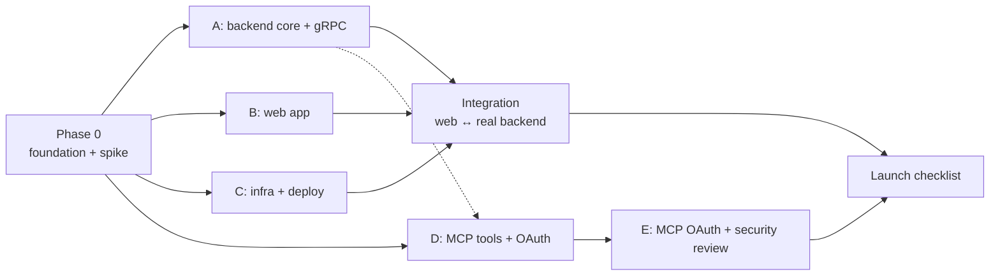
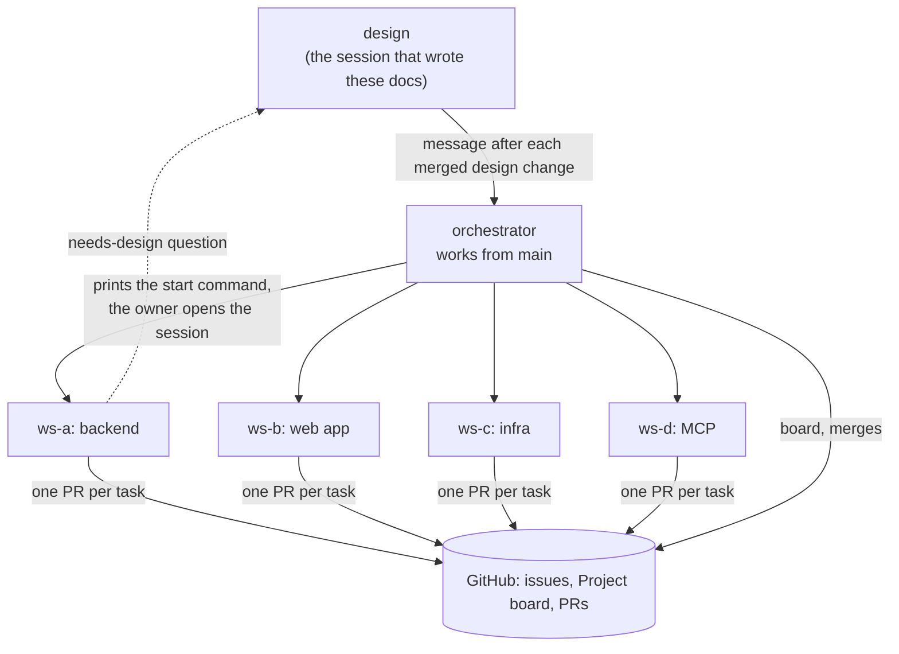

# Focus Ledger — Execution Plan (v1)

Status: draft for review. Everything in this doc is **proposed** until approved. Setup details are in [`setup.md`](setup.md).

The goal: get the first working version out fast by running several Claude Code sessions in parallel. Parallel work is possible only when the contracts between the parts are fixed first. So the plan has one short serial phase, then parallel workstreams.

## The contracts that make parallel work possible

| Contract | Between | Where |
|---|---|---|
| The `.proto` files | Web app ↔ backend | `proto/` (from `api.md`) |
| The schema (`V1__init.sql`) | Backend ↔ database | `backend/data/.../V1__init.sql` (from `schema.md`) |
| The core service interfaces | gRPC handlers ↔ MCP tools ↔ core | `backend/core/` (written in Phase 0) |

A worker session never changes a contract on its own. A contract change is a question for the design session (see "Orchestration").

## Schedule update (2026-09-28): parallel from item 2

The owner asked for 24/7 work and a faster finish. From Phase 0 item 2 on, work runs in parallel. Each piece starts as soon as its dependency merges:

| Piece | Worker | Starts after |
|---|---|---|
| 0.3 core interfaces | ws-a | 0.2 (the contracts) |
| 0.4 CI skeleton, 0.5 spike | ws-c | provisioning |
| Web app (against a fake `LedgerService`) | ws-b | 0.2 |
| MCP tools + OAuth sign-in | ws-d | 0.3 |
| Backend core + gRPC | ws-a | 0.3 |
| MCP OAuth + security review | ws-e | ws-d, and a `START` from design |

The orchestrator runs a self-paced loop (about every 30 minutes) that merges passing PRs, routes questions, and starts workers whose dependency merged. The contract rule is unchanged. The sections below describe the original serial order.

## Phase 0: foundation (serial, one session)

Phase 0 unblocks everything else. It runs in one session, in this order:

1. **Repo scaffold.** The Gradle build with the modules from `setup.md`, `docker-compose.yml`, `.env.example`, the license, a README.
2. **Contracts into the repo.** The `.proto` files and code generation for Kotlin and TypeScript. `V1__init.sql` with the roles and grants. Flyway runs it against local Postgres.
3. **Core service interfaces.** The Kotlin interfaces for the ledger and account services, with their input and output types, and no implementation yet. With these, the backend, MCP, and test work can proceed side by side.
4. **CI skeleton.** GitHub Actions: build, `buf lint`, the tests, and a `gitleaks` secret scan, on every PR. `.gitignore` covers `.env` files.
5. **The spike.** Prove three things, and write the results in the PR:
    1. A browser gRPC-Web call reaches Armeria.
    2. An MCP tool call works through the Armeria `/mcp` forward to Ktor, including a streamed response.
    3. The cold-start time on Cloud Run, as a normal JVM and as a GraalVM native image.
    4. jOOQ code generation, Flyway, and Testcontainers all work with Postgres 18.

Phase 0 ends when all five are merged and CI is green. If the spike fails on item 2, the design session decides the fallback before Phase 1 starts.

## Phase 1: parallel workstreams

| Workstream | Builds | Depends on | Can start |
|---|---|---|---|
| **A. Backend core + gRPC** | The core services, jOOQ repositories, the 10 RPCs, Google sign-in and session cookies, user-isolation tests | Phase 0 | right after Phase 0 |
| **B. Web app** | Sign-in, Today, the running timer, the Tree, the Report, Settings, the roll-up code in TypeScript | Phase 0 (the generated TypeScript client) | right after Phase 0. It develops against a fake `LedgerService` that returns fixed data, then switches to the real backend at integration. |
| **C. Infra + deploy** | The Google Cloud project, service accounts, Workload Identity Federation, Secret Manager, Neon with the two roles, the Cloudflare domain, the CI deploy job | Phase 0 | right after Phase 0 |
| **D. MCP tools + OAuth** | The Ktor MCP server, the 8 tools, the Kotlin summaries, OAuth 2.1 sign-in and the `agent_connection` table | The core interfaces (Phase 0). The tools call A's implementations once they land. | right after Phase 0 |
| **E. Security review** | The OAuth attack-case tests, rate limits, a review of the whole system against the security rules | D | after D |

**Integration** connects the web app to the real backend on a deployed environment. **The launch checklist** covers error tracking, an uptime monitor, database backups, and a final pass of the user-isolation tests.

## Orchestration

Three kinds of Claude Code sessions work together. Every session runs in a normal permission mode, on this Mac.

| Session | Name | Does | Does not |
|---|---|---|---|
| Design | `design` | Owns `docs/`. Answers `needs-design` questions. Approves every contract change. Messages the orchestrator after each merged design change. | Write feature code |
| Orchestrator | `orchestrator` | Turns this plan into GitHub issues. Keeps the Project board and the tracker issue current. Prints the start command for each worker. Reviews PRs and merges them. | Change the design, or build from anything that is not on `main` |
| Worker | `ws-a` … `ws-e` | Builds one workstream in its own git worktree. Opens one PR per task, with tests. | Change a contract, merge its own PR, or deploy |

### The rules of the flow

1. **`main` holds the approved design and the merged code.** The orchestrator builds only from what is on `main`. A doc on an open branch is still under discussion.
2. **Nothing starts on its own.** A merged doc does not start any work. The orchestrator starts a part of the build (for example "Phase 0, items 1–3") only after a `START` message from the design session, or a direct instruction from the owner. The message names the part, the doc sections, and what is out of scope.
3. **Every change goes through a PR.** Branch protection on `main` requires a PR and a green CI run, and blocks direct pushes, including the owner's. It does not require a review approval, so no PR waits on the owner.
4. **Merging is automatic.** The orchestrator merges a PR without waiting for the owner, after four checks: CI compiles everything and all tests pass; the PR includes the tests required below; a normal code review of the diff (`/code-review medium`) finds no unresolved issue; and the issue's acceptance criteria are met. It does not merge a PR with the `hold` label. The owner adds `hold` to look at a PR first, and reviews any other PR from the history whenever convenient.
5. **Every PR includes tests.** A PR that adds or changes behavior adds tests for it:
    - Unit tests for the rules in `backend/core`, for example each allowed and each rejected cycle change.
    - Integration tests against a real Postgres (Testcontainers) for repositories and RPCs.
    - A user-isolation test for every RPC and MCP tool: user B uses user A's ID and gets `NOT_FOUND`, and A's data does not change.
    - Tests for the roll-up code in the web app, and for the summaries in the MCP layer, from the same shared example data.

    The orchestrator does not merge a behavior change without tests. A PR that only changes docs or configuration needs none.
6. **A design change reaches the build through a docs PR.** The design session updates the doc in a small PR. After it merges, the design session messages the orchestrator: a two-line summary, the affected workstreams, and the PR link. The orchestrator then updates the affected issues and tells the affected workers.
7. **The orchestrator starts the workers itself, as live sessions the owner can see.** Each worker runs in its own window of one tmux session named `focus-ledger`, in its own git worktree. The owner opens all of them at once as native iTerm2 tabs with `tmux -CC attach -t focus-ledger`, and can watch or type into any worker. A worker still asks the owner for its own permissions. The orchestrator cannot approve anything for it.
8. **Questions go to the design session two ways.** The worker messages `design`, and adds the `needs-design` label with the question on its issue. The message is the fast path. The issue is the permanent record.
9. **The first orchestrator task is a dry run** with one small worker: open an issue, start the worker, message it, get a PR, merge it.

### GitHub is the shared record

Sessions can end at any time, so every piece of state lives on GitHub, not in a session's memory. Messages between sessions are only nudges.

- **One issue per task**, labeled with its workstream (`ws:A` … `ws:E`). The issue holds the scope, the acceptance criteria, and links to the design sections.
- **One PR per task.** The PR description says what was verified and how.
- **The GitHub Project board** shows every issue and PR in one of these columns: Ready, In progress, Needs design, In review, Blocked, Done.
- **A pinned tracker issue** holds the checklist of Phase 0 and the workstreams. The orchestrator ticks items off as PRs merge.
- **Labels:** `needs-design` (a question for the design session), `blocked` (waits on another task), `hold` (the owner wants to look before the merge).

### Rules for every session

1. A worker never changes a contract (`proto/`, the schema, the core interfaces). It asks a `needs-design` question instead.
2. Every PR deploys on its own. No PR depends on a later PR to work.
3. Every PR that changes behavior includes tests.
4. Push after each commit.
5. Run the module checks and the formatter before every push.
6. A test that fails even once in repeated local runs is not merged.
7. No secrets in files, commits, or logs.
8. Nobody deploys without asking the owner first.
9. Every session uses tokens on its own. Five sessions use about five times as much as one.

### Starting a worker

A fresh git worktree has no `node_modules` and no generated code. Each worker starts with the setup commands in `CLAUDE.md`: install the web dependencies, run the code generation, and start local Postgres.

## Inputs from the owner, and what waits for them

| Input | Needed by | Until it arrives |
|---|---|---|
| Screen designs | ws-b | ws-b builds the API client, roll-ups, timer, and state with plain, unstyled screens. Styling follows the designs. |
| Google OAuth client ID | ws-a (real sign-in) | ws-a builds and tests `SignIn` with tokens signed by a test key. The real client ID is set later as `GOOGLE_CLIENT_ID`. |
| Google Cloud project, Neon account, domain | ws-c | ws-c does not start. Phase 0, ws-a, ws-b, and ws-d run locally. |

## Open items

None block Phase 0. The owner provides the inputs above when ready.
