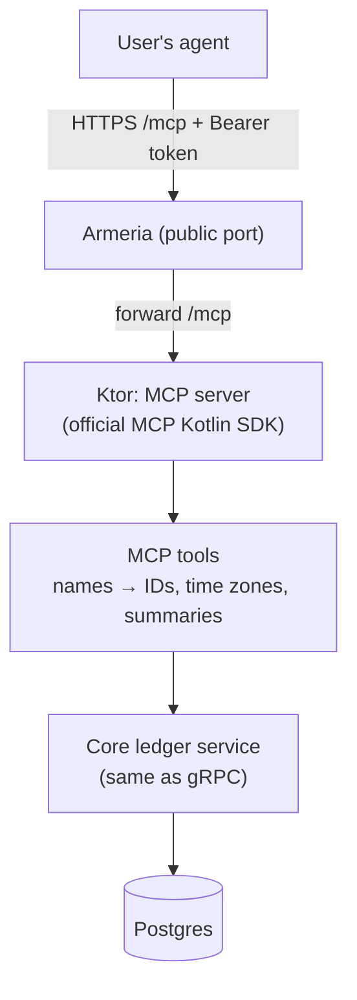
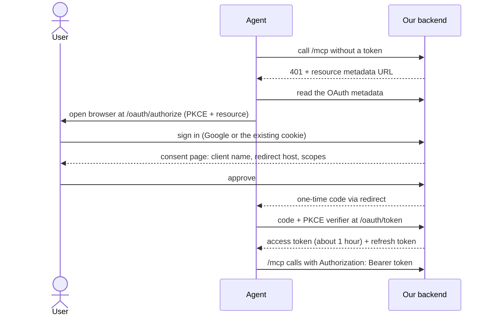

# Focus Ledger — MCP Server Design (v1)

Status: draft for review. The system architecture is in [`architecture.md`](architecture.md). The core API is in [`api.md`](api.md).

The MCP server lets a user's AI agent read and log their work. Examples: "log 50 minutes of deep focus on Backend yesterday at 3 PM", or "how much deep work did I do this week?"

## Decisions

| # | Decision | Status |
|---|---|---|
| 1 | The MCP server is an adapter inside the backend. It calls the same core ledger service as the gRPC handlers. No backend rule or RPC changes for MCP. | Agreed |
| 2 | The `list_nodes` tool returns the tree with totals for a period, computed on top of the `ListNodes` logic. | Agreed |
| 3 | Times are UTC by default. A tool call can pass a `time_zone`, and the MCP layer converts. | Agreed |
| 4 | Agents sign in with personal access tokens first, then OAuth 2.1 built into our backend. | Agreed |
| 5 | MCP (with personal access tokens) is built in parallel with the web app after Phase 0. OAuth follows it. See `execution-plan.md`. | Agreed |

## Architecture



- The MCP tools are thin. They resolve node paths to IDs, convert time zones, and compute summaries. Every rule stays in the core.
- The token check turns the Bearer token into a `user_id`. Every query then filters by that user, the same as for the web app.
- The user's agent pays for its own model tokens. Our server makes no model calls, so our cost per MCP call is a normal request.

## Tools

| Tool | Does | Example request |
|---|---|---|
| `list_nodes` | Returns the tree with paths, estimate progress, and totals for a period, plus the Inbox and the grand total | "How much deep work this week?" |
| `create_node` | Creates a node under a parent path | "Add a Wireframes task under Design" |
| `start_cycle` | Starts a cycle on a node with a mode and length | "Start 90 minutes of deep focus on Backend" |
| `stop_cycle` | Stops the running cycle | "Stop my timer" |
| `get_running_cycle` | Returns the running cycle and the time left | "What am I working on?" |
| `log_cycle` | Writes a hand entry: node, mode, start, minutes | "Log 50 minutes of execution on Frontend yesterday at 3 PM" |
| `file_cycle` | Moves an Inbox cycle to a node | "File this morning's cycle to Design" |
| `set_estimate` | Sets a node's estimate per mode | "Estimate Backend at 3 deep focus cycles" |

`list_nodes` takes `period` (`today`, `this_week`, or a start and end) and an optional `time_zone`. Its response is compact text, for example:

```
Website Relaunch            today 1h 30m · week 12h 10m · est 5 of 8
  Design                    today 0      · week 3h 50m
  Execution                 today 1h 30m · week 8h 20m
Inbox                       today 25m
Total                       today 1h 55m (Deep 1h 30m · Shallow 25m)
```

An agent reads the paths in this tree to find a node, so there is no separate search tool.

## Time zones

- The server stores and returns UTC.
- A tool call can pass `time_zone` (an IANA name such as `Asia/Kolkata`). The MCP layer then turns "today" and "this week" (starting Monday) into UTC ranges before it calls the core, and converts the times in the response into that zone.
- The core never handles time zones.

## Agent sign-in (OAuth 2.1)

The design follows the [MCP authorization specification (2025-11-25)](https://modelcontextprotocol.io/specification/2025-11-25/basic/authorization). Our backend is both the MCP server and the authorization server.



What the backend builds:

| Piece | Requirement |
|---|---|
| `/.well-known/oauth-protected-resource` | Required (RFC 9728). Names our authorization server and the scopes. |
| `/.well-known/oauth-authorization-server` | Lists the endpoints. Declares PKCE `S256` and Client ID Metadata Document support. |
| `/oauth/authorize` + consent page | The user approves one client and picks scopes. Shows the client name and redirect host. Protected against forged form posts. |
| `/oauth/token` | Swaps a code for tokens. Verifies PKCE. Codes are single-use and expire quickly. Redirect URIs must match exactly. |
| Refresh tokens | Rotated on every use. A reused old refresh token revokes the whole grant. |
| Client identity | Client ID Metadata Documents: the client ID is an HTTPS URL to a JSON file. The fetch must block internal addresses. |
| Token check at `/mcp` | Signature, expiry, and audience (the token must be issued for our `/mcp`). Invalid tokens get `401`. Missing scopes get `403`. |

Scopes:
- `ledger:read`: `list_nodes`, `get_running_cycle`.
- `ledger:write`: all other tools.

Schema consequence: one new table for agent grants, so a user can see connected agents and disconnect one:

```
agent_grant(user_id, client_id, client_name, scopes, refresh_token_hash, created_at, last_used_at, revoked_at)
```

Access tokens are signed and short-lived, so they need no table.

Effort: a few focused days, plus tests for each attack case: a reused code, a wrong redirect URI, a missing PKCE verifier, a token for another audience, and a reused refresh token. The token and JWT work uses a maintained library.

Other options that were considered:
- **Personal access tokens:** the user creates a key in Settings and pastes it into the agent's configuration. It is the simplest, and it works with developer agents that accept a custom header. Chat apps' remote connectors generally expect OAuth.
- **A hosted auth provider** as the authorization server: less code, but a third-party dependency, which is awkward for self-hosting.

## Rules for writing the tools

| Area | Rule |
|---|---|
| Design | Few tools, named after what a user wants to do. Short descriptions, because the agent's model reads them on every turn. |
| Inputs | Accept node paths. If a path matches more than one node, return the matches and ask. |
| Outputs | Finished numbers in compact text. UTC unless `time_zone` is given. |
| Safety | `create_node`, `start_cycle`, and `log_cycle` accept an optional `request_id`. When the agent sends one, a retry of the same call creates nothing twice. When it does not, the tool makes a new one for the call. There are no delete tools. |
| Errors | Return a message the agent can act on, for example "No node named 'Backnd'. Did you mean 'Backend'?" |
| Prompt injection | Node names are user text. The tools return them as data, never as instructions. |
| Limits | Rate-limit per token, so a looping agent cannot flood the server. |
| Testing | Test with the MCP Inspector and with a real agent before release. |

## Open items

1. The spike: prove the Armeria `/mcp` forward to Ktor, including a streamed response.
