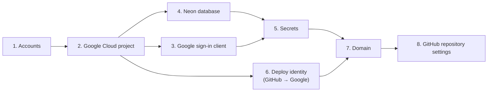

# Runbook: sign-ups and provisioning

Status: draft. The owner runs this once, before workstream C (infra and deploy) starts. The commands come from the design docs and the product documentation. They have not been run yet. Check each one against the console as you go, and correct this runbook where it differs.

The design behind every step is in [`../setup.md`](../setup.md) and [`../architecture.md`](../architecture.md).

## The one rule for this whole runbook

**No secret goes into a file, a commit, a chat, a note, or a log.** Secrets are passwords, keys, tokens, and connection strings. Each secret goes from your terminal straight into Google Secret Manager (or into Neon's SQL editor), and nowhere else.

To handle a secret in the terminal without leaving it anywhere:

```bash
read -rs VALUE        # type or paste; nothing shows and nothing is saved in the history
printf '%s' "$VALUE" | gcloud secrets versions add <SECRET_NAME> --data-file=- --project="$PROJECT_ID"
unset VALUE
```

To generate a password without writing it down:

```bash
VALUE=$(openssl rand -base64 32)   # use it in the same terminal, then: unset VALUE
```

## Order



## 1. Accounts

| Account | Sign up at | Notes |
|---|---|---|
| Google Cloud | console.cloud.google.com | Use the personal Google account. Start the free trial ($300 for 90 days, for new customers). A card is required. Start it only when workstream C is ready, because the 90 days start at sign-up. |
| Neon | neon.com | Sign in with GitHub or Google. The free plan is enough. |
| Cloudflare | cloudflare.com | For the domain and DNS. The free plan is enough. |
| GitHub | already set up | Repository `SaumyaKarnwal/focus-ledger` |

The Google Cloud CLI (`gcloud`) is already installed on this Mac, and its default profile is signed in to a work account. Focus Ledger gets its own profile, so nothing touches the work setup:

```bash
gcloud config configurations create focus-ledger   # creates and activates a separate profile
gcloud auth login                                  # opens the browser; choose the PERSONAL account
gcloud config list                                 # check: account = the personal address
```

Every command below runs in this profile. Before each session of this runbook, check `gcloud config list`. To go back to work: `gcloud config configurations activate default`. To return here: `gcloud config configurations activate focus-ledger`.

The command names and flags in this runbook were checked against the installed `gcloud` (563.0.0). The calls themselves have not been run.

## 2. Google Cloud project

```bash
export PROJECT_ID=focus-ledger-prod          # must be globally unique; add a suffix if taken
export REGION=us-east4                       # Northern Virginia; close to Neon's aws-us-east-1

gcloud projects create "$PROJECT_ID" --name="Focus Ledger"
gcloud billing accounts list                 # copy the billing account ID
gcloud billing projects link "$PROJECT_ID" --billing-account=<BILLING_ACCOUNT_ID>

gcloud services enable --project="$PROJECT_ID" \
  run.googleapis.com artifactregistry.googleapis.com secretmanager.googleapis.com \
  iam.googleapis.com iamcredentials.googleapis.com sts.googleapis.com \
  cloudresourcemanager.googleapis.com
```

### The $5 limit

Set both of these before anything runs. A budget alert only sends email. It does not stop spending, so the hard cap comes from the Cloud Run settings.

1. **Budget alert:** **Billing → Budgets & alerts → Create budget**. Amount **$5 per month**, for this project. Email alerts at 50%, 90%, and 100% of the budget.
2. **Hard cap on Cloud Run** (workstream C sets these on every deploy):
   - `--max-instances=1`: never more than one copy runs, so the compute cost has a ceiling.
   - `--min-instances=0`: no copy runs while idle, so idle time costs nothing.
   - `--memory=512Mi --cpu=1`: a small instance.
   - `--concurrency=80`: one copy serves many requests at once, so one instance is enough at this scale.
3. **Check the bill weekly** for the first month: **Billing → Reports**, filtered to this project.

With these settings, normal use stays inside the always-free allowance ($0). If something unusual happens, the budget email arrives, and one instance at most limits how fast cost can grow.

Upgrade to a paid account before day 90 of the trial. If the trial ends first, Google shuts down the workloads.

Create the container registry:

```bash
gcloud artifacts repositories create focus-ledger \
  --repository-format=docker --location="$REGION" --project="$PROJECT_ID"
```

## 3. Google sign-in client (OAuth client ID)

In the console, **APIs & Services**:

1. **OAuth consent screen:** user type "External". App name "Focus Ledger", your support email. Scopes: `openid`, `email`, `profile` only. These are basic scopes.
2. **Credentials → Create credentials → OAuth client ID:** type "Web application".
   - Authorized JavaScript origins: `http://localhost:5173` (local web app) and `https://<your domain>` (after step 7).
3. Copy the **client ID**. The sign-in design uses only the client ID; do not create or store a client secret.

The client ID is not a secret (the browser sees it), but it goes into Secret Manager with the other configuration so that every setting lives in one place.

## 4. Neon database

1. Create a project: name `focus-ledger`, **Postgres 18**, region **AWS US East (N. Virginia)**. Keep the default database `neondb` and the default role `neondb_owner`.
2. Open the **SQL editor** (connected as `neondb_owner`) and run the role script from [`../setup.md`](../setup.md), "How the roles are created". It also installs `citext` and closes the default `CONNECT` and `TEMPORARY` rights. For each `PASSWORD '<generated>'`:
   - generate a password in the terminal (`openssl rand -base64 32`),
   - paste it into the SQL editor and into the matching secret in step 5, in the same sitting,
   - then clear the terminal. Do not save it anywhere else.
3. From **Connect**, copy two connection strings for each role, and put them straight into step 5:
   - `focusledger_app`: the **pooled** string (the host contains `-pooler`).
   - `focusledger_migrate`: the **direct** string (no `-pooler`).

## 5. Secrets

Create the four secrets, then add one version to each with the `read -rs` pattern above:

```bash
for NAME in DB_URL_APP DB_URL_MIGRATE SESSION_SIGNING_KEY GOOGLE_CLIENT_ID; do
  gcloud secrets create "$NAME" --replication-policy=automatic --project="$PROJECT_ID"
done
```

| Secret | Value |
|---|---|
| `DB_URL_APP` | the pooled connection string for `focusledger_app` |
| `DB_URL_MIGRATE` | the direct connection string for `focusledger_migrate` |
| `SESSION_SIGNING_KEY` | a new random value: `openssl rand -base64 48` |
| `GOOGLE_CLIENT_ID` | the client ID from step 3 |

The free tier covers 6 active secret versions. When you rotate a secret, destroy the old version.

## 6. Deploy identity: service accounts and GitHub sign-in

```bash
gcloud iam service-accounts create focusledger-run    --project="$PROJECT_ID" --display-name="Focus Ledger service"
gcloud iam service-accounts create focusledger-deploy --project="$PROJECT_ID" --display-name="Focus Ledger deploy"

RUN_SA=focusledger-run@$PROJECT_ID.iam.gserviceaccount.com
DEPLOY_SA=focusledger-deploy@$PROJECT_ID.iam.gserviceaccount.com

# the service reads only its own secrets
for NAME in DB_URL_APP SESSION_SIGNING_KEY GOOGLE_CLIENT_ID; do
  gcloud secrets add-iam-policy-binding "$NAME" --project="$PROJECT_ID" \
    --member="serviceAccount:$RUN_SA" --role=roles/secretmanager.secretAccessor
done

# the deploy job: push images, deploy the service, act as the service identity, run migrations
gcloud artifacts repositories add-iam-policy-binding focus-ledger --location="$REGION" --project="$PROJECT_ID" \
  --member="serviceAccount:$DEPLOY_SA" --role=roles/artifactregistry.writer
gcloud projects add-iam-policy-binding "$PROJECT_ID" \
  --member="serviceAccount:$DEPLOY_SA" --role=roles/run.admin
gcloud iam service-accounts add-iam-policy-binding "$RUN_SA" --project="$PROJECT_ID" \
  --member="serviceAccount:$DEPLOY_SA" --role=roles/iam.serviceAccountUser
gcloud secrets add-iam-policy-binding DB_URL_MIGRATE --project="$PROJECT_ID" \
  --member="serviceAccount:$DEPLOY_SA" --role=roles/secretmanager.secretAccessor
```

Let GitHub Actions act as the deploy account with Workload Identity Federation. Only the `main` branch of this repository can use it, and no key file exists:

```bash
PROJECT_NUMBER=$(gcloud projects describe "$PROJECT_ID" --format='value(projectNumber)')

gcloud iam workload-identity-pools create github --location=global --project="$PROJECT_ID"
gcloud iam workload-identity-pools providers create-oidc focus-ledger \
  --location=global --workload-identity-pool=github --project="$PROJECT_ID" \
  --issuer-uri="https://token.actions.githubusercontent.com" \
  --attribute-mapping="google.subject=assertion.sub,attribute.repository=assertion.repository,attribute.ref=assertion.ref" \
  --attribute-condition="assertion.repository=='SaumyaKarnwal/focus-ledger' && assertion.ref=='refs/heads/main'"

gcloud iam service-accounts add-iam-policy-binding "$DEPLOY_SA" --project="$PROJECT_ID" \
  --role=roles/iam.workloadIdentityUser \
  --member="principalSet://iam.googleapis.com/projects/$PROJECT_NUMBER/locations/global/workloadIdentityPools/github/attribute.repository/SaumyaKarnwal/focus-ledger"
```

Never create a service-account key (`gcloud iam service-accounts keys create`). Nothing in this design needs one.

## 7. Domain

1. In Cloudflare, **Domain Registration → Register domains**, and buy the domain (about $10.44 a year for `.com` at cost, rising to $11.15 from November 1, 2026).
2. Cloudflare becomes the DNS for the domain automatically.
3. How the domain reaches Cloud Run (a Cloud Run domain mapping, or a Cloudflare route to the service URL) is decided in workstream C.
4. Add `https://<your domain>` to the authorized origins of the sign-in client (step 3).

## 8. GitHub repository settings

**Variables, not secrets:** these values are identifiers, not credentials. Add them under **Settings → Secrets and variables → Actions → Variables**:

| Variable | Value |
|---|---|
| `GCP_PROJECT_ID` | `$PROJECT_ID` |
| `GCP_REGION` | `$REGION` |
| `GCP_WIF_PROVIDER` | `projects/$PROJECT_NUMBER/locations/global/workloadIdentityPools/github/providers/focus-ledger` |
| `GCP_DEPLOY_SA` | `$DEPLOY_SA` |

The repository needs **no GitHub secrets** for deploys. The workflow gets short-lived Google credentials from Workload Identity Federation and reads the database password from Secret Manager at run time.

**Secret scanning:** turn on secret scanning and push protection under **Settings → Code security**, where the plan allows it. The CI also runs `gitleaks` on every PR (see `CLAUDE.md`), so a secret in a PR fails the build even without those settings.

## When you finish

Tell the design session which steps are done. It records the provisioning state (with no secret values) and starts workstream C.
