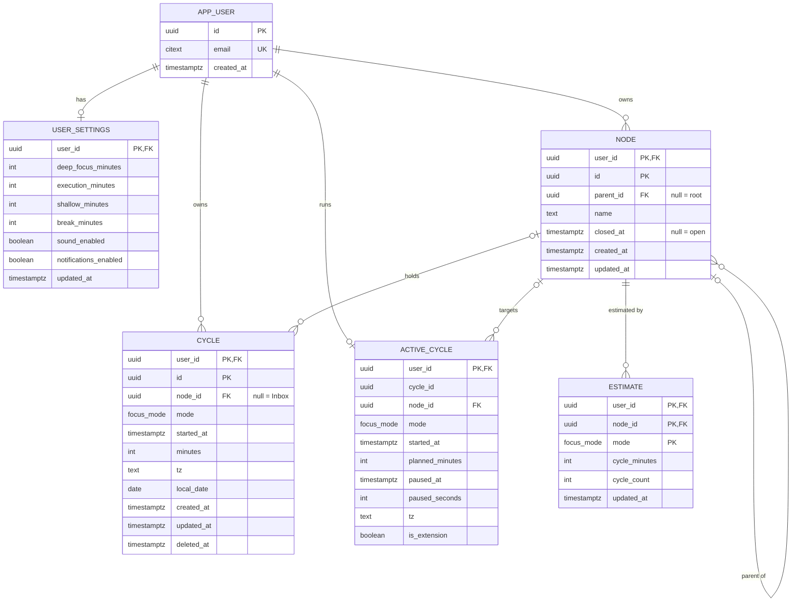

# Focus Ledger — Schema Design (v1)

Status: draft for review. The PRD is in [`docs/prd.md`](prd.md).

## Decisions to confirm

Each decision below changes columns. The first one changes every table.

1. **The client creates every ID as a UUIDv7.** The PRD needs full function with no account (I-8) and a merge on sign-in (FR-12.6: 12 local + 40 account = 52). Client-made IDs let the browser create rows offline and merge them without collisions. A server-first design would change this.
2. **A written cycle allows three changes, and only three.** I-1 says that a cycle never changes. But the PRD itself writes to a cycle in two places: filing an Inbox cycle (FR-9.4) and the bell extension (FR-4.6). The proposed rule is: file once (`node_id` NULL → value), add minutes (never remove them), and soft delete. A database trigger enforces this rule.
3. **A delete is a soft delete (`deleted_at`).** With sync between devices, a hard delete on one device can come back from another device. The roll-up index skips deleted rows, so reads do not slow down.
4. **Each cycle stores its time zone.** Reports work in the user's local days (FR-8.4, FR-11.3). A UTC timestamp alone cannot tell which day a cycle belongs to after the user travels. The cycle stores `tz` (IANA name), and the database derives `local_date` once, at insert.
5. **The node stores no cycle data.** "Most recently worked" (FR-10.1) comes from `MAX(started_at)` over the user's cycles. A stored copy on the node would go stale after a delete or a filing.
6. **The running timer has a server table (`active_cycle`).** The server table lets a signed-in user see a running cycle on a second device. The alternative is to keep timer state only in the browser.
7. **The tree uses an adjacency list** (`parent_id`). The benchmark showed a full roll-up for one user in about 1 ms with 20M cycles in the table. No closure table in v1.

## ER diagram



`focus_mode` is a Postgres enum with three values: `deep_focus`, `execution`, `shallow`. The PRD fixes the modes for v1, so a lookup table adds nothing.

## Tables

| Table | Holds | Rows per user |
|---|---|---|
| `app_user` | The account: identity and email | 1 |
| `user_settings` | The FR-12.1 defaults: three mode lengths, break length, sound, notifications | 1 |
| `node` | The tree of things you work on | ~100 |
| `cycle` | The ledger. The only table that holds time. | ~2,500 per year |
| `estimate` | Up to three rows per node, one per mode | ≤ 3 per node |
| `active_cycle` | The running timer. It is not part of the ledger. | 0 or 1 |

Every table except `app_user` has `user_id` as the first key column. Every reference between rows is a composite foreign key that includes `user_id`, for example `(user_id, node_id) → node (user_id, id)`. So a row can never point at another user's data, and every query and index starts with `user_id`.

There is no `break` table. FR-5.5 keeps breaks out of the ledger.

### `app_user`

| Column | Type | Notes |
|---|---|---|
| `id` | uuid | Primary key. |
| `email` | citext | Unique. `citext` compares case-insensitively, so `A@x.com` and `a@x.com` are one account. |
| `created_at` | timestamptz | |

The sign-in method (magic link, OAuth, password) is not decided. Credentials go in a separate table after that decision.

### `user_settings`

| Column | Type | Default | Check |
|---|---|---|---|
| `user_id` | uuid | | Primary key, references `app_user`. |
| `deep_focus_minutes` | int | 90 | 1–480 |
| `execution_minutes` | int | 50 | 1–480 |
| `shallow_minutes` | int | 25 | 1–480 |
| `break_minutes` | int | 5 | 1–60 |
| `sound_enabled` | boolean | true | |
| `notifications_enabled` | boolean | false | |
| `updated_at` | timestamptz | now() | Set by trigger. |

These are fixed columns, not a JSON blob. FR-12.1 says "nothing else in v1", so the set is small and known.

### `node`

| Column | Type | Notes |
|---|---|---|
| `user_id` | uuid | Key part 1. |
| `id` | uuid | Key part 2. |
| `parent_id` | uuid, null | Null means a root. Composite FK to `node`. |
| `name` | text | 1–200 characters after trimming. |
| `closed_at` | timestamptz, null | Null means open. A timestamp keeps the close time. The PRD only needs a boolean. |
| `created_at`, `updated_at` | timestamptz | |

Rules:
- A move changes one row (`parent_id`). The cycles do not change, so they move with the node (FR-7.4, FR-7.5).
- A trigger rejects a move under the node's own descendant (FR-7.8).
- Siblings sort by `created_at`, then `id`. The PRD has no manual reorder. When you type a project top-down (FR-7.2), the creation order is the typed order.
- There is no node delete. The PRD only has close (FR-7.7).
- The node stores no minutes, counts, or "last worked" time.

Index: `(user_id, parent_id, created_at)` lists the children of a node in the order they were created.

### `cycle`

| Column | Type | Notes |
|---|---|---|
| `user_id` | uuid | Key part 1. |
| `id` | uuid | Key part 2. The client creates it at Start, so a retried Stop cannot write two rows. |
| `node_id` | uuid, null | Null means Inbox (I-6). It can be set once (FR-9.4). |
| `mode` | focus_mode | Never null (I-2). |
| `started_at` | timestamptz | |
| `minutes` | int | 1–1440. A cycle under 1 minute is not written (FR-3). It can only grow (FR-4.6). |
| `tz` | text | IANA zone at the time of the entry. An unknown zone is rejected. |
| `local_date` | date | Derived at insert from `started_at` in `tz`. Reports group by this column. |
| `created_at`, `updated_at` | timestamptz | `updated_at` gives sync a "changed since" cursor. |
| `deleted_at` | timestamptz, null | Soft delete. A deleted cycle cannot change again. |

A timer cycle and a hand-typed cycle have the same columns (I-3). No column tells them apart.

Indexes:
- `cycle_rollup`: `(user_id, local_date) INCLUDE (node_id, mode, minutes, started_at) WHERE deleted_at IS NULL`. Every roll-up, the Today rail order, and the Inbox list read only this index.
- `cycle_node`: `(user_id, node_id)`. This index serves the foreign-key checks and "39 cycles will move with it" (FR-7.6).

### `estimate`

| Column | Type | Notes |
|---|---|---|
| `user_id`, `node_id`, `mode` | | Primary key. One row per node per mode. |
| `cycle_minutes` | int | Length of one cycle, 1–480. |
| `cycle_count` | int | Number of cycles, 0 or more. |
| `updated_at` | timestamptz | |

`Deep Focus 90 × 2` is one row: `cycle_minutes = 90, cycle_count = 2`.

`cycle_minutes` is the length at the time the estimate was saved. The mode default in `user_settings` only fills the stepper for a new estimate. A later change to that default does not change a saved estimate or its pips.

A node is un-estimated when no row has `cycle_count > 0`. To clear an estimate, the app sets the counts to 0. It does not delete the rows, so sync needs no tombstones for estimates.

An estimate covers only the node's own cycles (I-4). The roll-up adds up estimates the same way as cycles.

### `active_cycle`

| Column | Type | Notes |
|---|---|---|
| `user_id` | uuid | Primary key, so one running cycle per user. |
| `cycle_id` | uuid | The ID that the cycle row gets at Stop. |
| `node_id` | uuid, null | Fixed at Start (I-2). |
| `mode` | focus_mode | Fixed at Start (I-2). |
| `started_at` | timestamptz | |
| `planned_minutes` | int | Length chosen at Start. |
| `paused_at` | timestamptz, null | Set while paused. A pause over 10 minutes stops the cycle (FR-3.6). |
| `paused_seconds` | int | Total paused time so far. |
| `tz` | text | Copied into the cycle at Stop. |
| `is_extension` | boolean | True after "Keep going" on the bell. The cycle row already exists, so Stop adds minutes to it and does not insert a new row (FR-4.6). |

Stop runs in one transaction:
1. If `is_extension` is false, insert the cycle. If it is true, add the elapsed minutes to the existing cycle.
2. Delete the `active_cycle` row.

## How the schema enforces the invariants

| Invariant | Enforcement |
|---|---|
| I-1 The log is append-only | Trigger `cycle_guard` allows only filing once, adding minutes, and soft delete. |
| I-2 Mode and node are bound before Start | `mode` is NOT NULL. `cycle_guard` rejects a mode change and a change to a filed `node_id`. |
| I-3 An entry is an entry | Timer and hand entries write the same columns. |
| I-4 Roll-up is own plus descendants | The roll-up query. No stored totals. |
| I-5 An estimate change never touches a cycle | Estimates are a separate table with no reference from `cycle`. |
| I-6 Unfiled time belongs to no project | `node_id` is null. The roll-up joins on `node_id`, so Inbox cycles enter no node's total. |
| I-7 Nothing starts itself | No server-side process creates an `active_cycle` row. |
| I-8 Works without an account | Client-made UUIDs. The browser store uses the same tables. |

## The roll-up query

The query sums the cycles per node first, then climbs the tree. The recursion runs over about 100 nodes, never over the cycles.

```sql
WITH RECURSIVE own AS (
  SELECT node_id, mode, SUM(minutes) AS minutes
  FROM cycle
  WHERE user_id = $1 AND deleted_at IS NULL
    AND local_date BETWEEN $2 AND $3
  GROUP BY node_id, mode
),
ancestors AS (
  SELECT id AS node_id, id AS ancestor FROM node WHERE user_id = $1
  UNION ALL
  SELECT a.node_id, n.parent_id
  FROM ancestors a
  JOIN node n ON n.user_id = $1 AND n.id = a.ancestor
  WHERE n.parent_id IS NOT NULL
)
SELECT ancestors.ancestor AS node_id, own.mode, SUM(own.minutes) AS minutes
FROM own JOIN ancestors USING (node_id)
GROUP BY ancestors.ancestor, own.mode;
```

The query plan uses an index-only scan on `cycle_rollup`.

## Verification

I wrote a draft DDL for this design, loaded it into Postgres 15, and ran these checks. The DDL is not in this PR. It follows after the design is agreed.

| # | Check | Result |
|---|---|---|
| 1 | A node with a parent from another user | rejected by the foreign key |
| 2 | A move of a node under its own descendant | rejected by the trigger |
| 3 | A legal move | accepted |
| 4 | Local date of 02:00 UTC in `America/Los_Angeles` | 2026-09-24 (the previous evening) |
| 5 | An unknown time zone | rejected |
| 6 | Filing an Inbox cycle | accepted |
| 7 | Re-filing a filed cycle | rejected |
| 8 | A mode change on a cycle | rejected |
| 9 | A bell extension, 50 → 65 minutes | accepted |
| 10 | Minutes reduced | rejected |
| 11 | Any change after a soft delete | rejected |
| 12 | A cycle of 0 minutes | rejected |
| 13 | Estimate rows | accepted |
| 14 | Account delete | removes all rows in all tables |

## Not in this schema

- Sign-in credentials. They depend on the sign-in method.
- The sync protocol. The `updated_at` and `deleted_at` columns prepare for it, and the RPC design defines it.
- The browser store. It uses the same tables and columns.
- The week start day. The proposal is Monday, and it is not a setting in FR-12.1.
- Manual sibling order. To add it later, add a `position` column, fill it from the `created_at` order, and change the sort. No other table changes.
