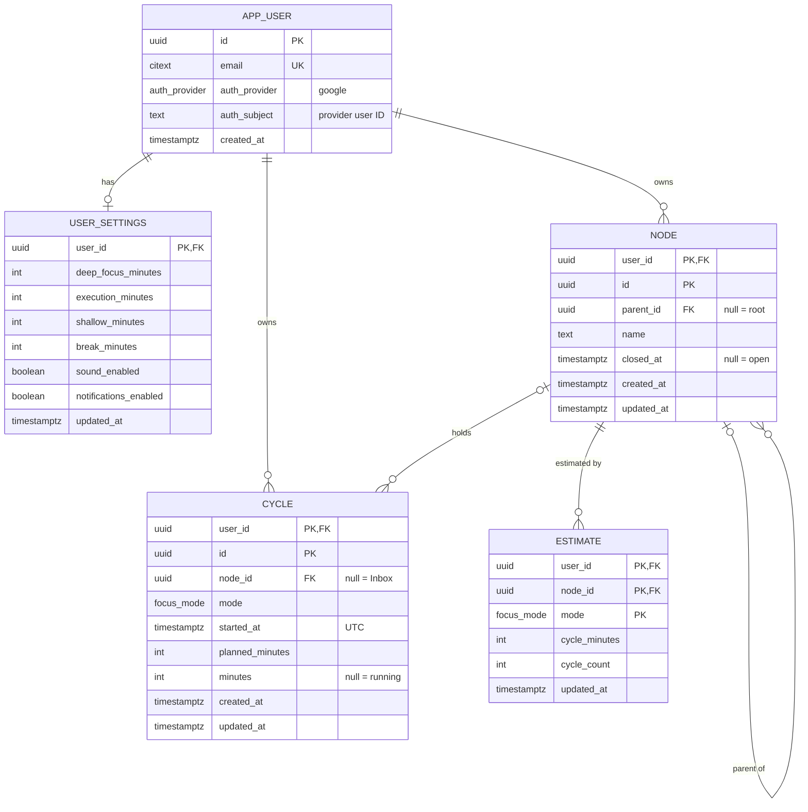
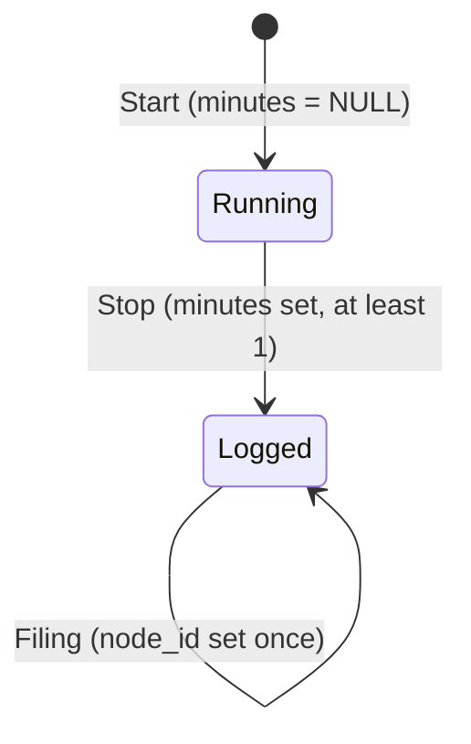

# Focus Ledger — Schema Design (v1)

Status: draft for review. The PRD is in [`docs/prd.md`](prd.md).

## Decisions

| # | Decision | Status |
|---|---|---|
| 1 | The database generates every ID. The server computes all data and roll-ups. | Agreed |
| 2 | One `cycle` table. The row is created at Start. There is no separate running-timer table. | Agreed |
| 3 | A cycle cannot be edited or deleted. It allows three changes: Stop, extension, and filing. | Agreed |
| 4 | All times are stored in UTC. The browser sends periods as UTC ranges. | Agreed |
| 5 | A cycle stores planned minutes and actual minutes. | Agreed |
| 6 | The node stores no cycle data. | Agreed |
| 7 | The tree uses an adjacency list (`parent_id`). | Agreed |

1. **Database-generated IDs, server holds the truth.** Every `id` has the default `gen_random_uuid()`. The client never makes an ID. The server stores the data and enforces the rules. The browser computes totals and roll-ups from the cycles.

    A user is identified by the sign-in provider's stable user ID (`auth_provider` + `auth_subject`), not by email. v1 has only Google, and every user has signed in. Guest accounts come later: `email`, `auth_provider`, and `auth_subject` then drop `NOT NULL`, and NULL means a guest.
2. **One `cycle` table, row created at Start.** Start writes the row with `minutes = NULL`. Stop sets `minutes`. The timer itself (countdown, pause) is a UI construct. On reopen, the app finds the running row and resumes from `started_at` and `planned_minutes`. Mode and node are in the database before the clock runs (I-2).
3. **No edit, no delete.** A cycle allows exactly three changes:
    - Stop sets `minutes` once (NULL → value).
    - A bell extension adds minutes (FR-4.6). Minutes never go down.
    - Filing sets `node_id` once on an unfiled cycle (FR-9.4).

    A database trigger enforces the rule. No cycle is ever deleted, running or logged. A Stop under 1 minute logs 1 minute (a PRD change to FR-3).
4. **UTC only.** `started_at` is a `timestamptz`, one column that holds both the date and the time. No time zone and no separate date column are stored. The browser computes "today", "this week", and report ranges in its own zone and sends them as UTC timestamps. The server needs no time-zone logic. The UI renders every time in the browser zone.
5. **Planned vs actual.** `planned_minutes` is the length chosen at Start. `minutes` is what was logged, including any extension. The difference lets us analyze estimates per mode, for example "Deep Focus cycles run 20% longer than planned".
6. **No cycle data on the node.** "Most recently worked" (FR-10.1) comes from `MAX(started_at)` over the user's cycles.
7. **Adjacency list.** The benchmark showed a full roll-up for one user in about 1 ms with 20M cycles in the table. No closure table in v1.

### PRD changes that these decisions need

- **I-8 and FR-12.3–12.6:** sign-in is required. There is no local-only mode and no local-to-account merge.
- **FR-1.7:** sign-in is the first step, not an optional header link.
- **FR-11.6:** export needs an account.
- **I-1 and FR-8.7** say that a cycle may be deleted. Decision 3 removes delete from v1.
- **FR-8 acceptance criteria:** "every entry offers delete" and "deleting an entry reverses its effect" go away.
- **FR-11.6** export: add `planned_minutes` to the columns.
- **FR-12 acceptance criteria:** "Deleting an account deletes its data" moves out of v1. The schema keeps `ON DELETE CASCADE`, so the later RPC is a single delete.
- **FR-3 acceptance criteria:** "Stopping under 1 minute writes no cycle" becomes "Stopping under 1 minute logs 1 minute".

## ER diagram

`focus_mode` is a Postgres enum with three values: `deep_focus`, `execution`, `shallow`. The PRD fixes the modes for v1, so a lookup table adds nothing.

## Tables

| Table | Holds | Rows per user |
|---|---|---|
| `app_user` | The account: identity and email | 1 |
| `user_settings` | The FR-12.1 defaults: three mode lengths, break length, sound, notifications | 1 |
| `node` | The tree of things you work on | ~100 |
| `cycle` | The ledger. The only table that holds time. | ~2,500 per year |
| `estimate` | Up to three rows per node, one per mode | ≤ 3 per node |

`app_user` and `user_settings` live in the Postgres schema `account` (personal data). `node`, `cycle`, and `estimate` live in the schema `ledger` (work data). See `setup.md` for the roles.

Every table except `app_user` has `user_id` as the first key column. Every reference between rows is a composite foreign key that includes `user_id`, for example `(user_id, node_id) → node (user_id, id)`. So a row can never point at another user's data, and every query and index starts with `user_id`.

There is no `break` table. FR-5.5 keeps breaks out of the ledger.

### `app_user`

| Column | Type | Notes |
|---|---|---|
| `id` | uuid | Primary key. Default `gen_random_uuid()`. |
| `email` | citext | The email from the ID token, for display. Unique. `citext` compares case-insensitively. |
| `auth_provider` | enum `auth_provider` | The provider that verified the user. v1 has one value: `google`. |
| `auth_subject` | text | The provider's permanent user ID: the `sub` claim of the Google ID token. |
| `created_at` | timestamptz | |

Constraints: all columns are `NOT NULL`. `UNIQUE (auth_provider, auth_subject)` gives one account per Google account.

Sign-in finds the user by `auth_provider` and `auth_subject`, never by email. One email belongs to one account. If a sign-in brings an email that another account already holds, `SignIn` rejects it with `ALREADY_EXISTS` and does not create or merge anything. Google says to use `sub` as the identifier, because an account's email can change and an address can be given to a new person ([Google docs](https://developers.google.com/identity/gsi/web/guides/verify-google-id-token)).

One account has one sign-in method. If one person later needs Google and Apple on the same account, these two columns move to a separate identity table.

### `user_settings`

| Column | Type | Default | Check |
|---|---|---|---|
| `user_id` | uuid | | Primary key, references `app_user`. |
| `deep_focus_minutes` | int | 90 | 1–480 |
| `execution_minutes` | int | 50 | 1–480 |
| `shallow_minutes` | int | 25 | 1–480 |
| `break_minutes` | int | 5 | 1–60 |
| `sound_enabled` | boolean | true | |
| `notifications_enabled` | boolean | false | |
| `updated_at` | timestamptz | now() | Set by trigger. |

These are fixed columns, not a JSON blob. FR-12.1 says "nothing else in v1", so the set is small and known.

### `node`

| Column | Type | Notes |
|---|---|---|
| `user_id` | uuid | Key part 1. |
| `id` | uuid | Key part 2. Default `gen_random_uuid()`. |
| `parent_id` | uuid, null | Null means a root. Composite FK to `node`. |
| `name` | text | 1–200 characters after trimming. |
| `closed_at` | timestamptz, null | Null means open. A timestamp keeps the close time. The PRD only needs a boolean. |
| `created_at`, `updated_at` | timestamptz | |

Rules:
- A move changes one row (`parent_id`). The cycles do not change, so they move with the node (FR-7.4, FR-7.5).
- A trigger rejects a move under the node's own descendant (FR-7.8).
- Siblings sort by `created_at`, then `id`. The PRD has no manual reorder. When you type a project top-down (FR-7.2), the creation order is the typed order.
- There is no node delete. The PRD only has close (FR-7.7).
- The node stores no minutes, counts, or "last worked" time.

Index: `(user_id, parent_id, created_at)` lists the children of a node in the order they were created.

### `cycle`

| Column | Type | Notes |
|---|---|---|
| `user_id` | uuid | Key part 1. |
| `id` | uuid | Key part 2. Default `gen_random_uuid()`. |
| `node_id` | uuid, null | Null means Inbox (I-6). Filing sets it once (FR-9.4). |
| `mode` | focus_mode | Set at Start. Never changes (I-2). |
| `started_at` | timestamptz | The start moment in UTC. Set at Start. Never changes. |
| `planned_minutes` | int | Length chosen at Start, 1–1440. Never changes. For a hand entry (FR-8), it equals the entered length. |
| `minutes` | int, null | NULL while the cycle runs. Stop sets it (1–1440). An extension adds to it. It never goes down. |
| `created_at`, `updated_at` | timestamptz | `updated_at` gives sync a "changed since" cursor. |

A timer cycle and a hand-typed cycle have the same columns (I-3). A hand entry is written in one step, with `minutes` already set.

Lifecycle of one cycle:

Indexes:
- `cycle_rollup`: `(user_id, started_at) INCLUDE (node_id, mode, minutes, planned_minutes) WHERE minutes IS NOT NULL`. Every roll-up, the Today rail order, the Inbox list, and the planned-vs-actual analysis read only this index. Running rows are not in it.
- `cycle_one_running`: unique `(user_id) WHERE minutes IS NULL`. A user has at most one running cycle.
- `cycle_node`: `(user_id, node_id)`. This index serves the foreign-key checks and "39 cycles will move with it" (FR-7.6).

**Time zones and travel.** The browser computes day and week ranges in its current zone. If a user logs a cycle at 11 PM in India and later views the report in California, that cycle shows on the California day of that moment. Cycles near midnight can move to a different day. We accept this for v1. If travel accuracy matters later, we add a zone column, and cycles logged before that change have no zone.

### `estimate`

| Column | Type | Notes |
|---|---|---|
| `user_id`, `node_id`, `mode` | | Primary key. One row per node per mode. |
| `cycle_minutes` | int | Length of one cycle, 1–480. |
| `cycle_count` | int | Number of cycles, 0 or more. |
| `updated_at` | timestamptz | |

`Deep Focus 90 × 2` is one row: `cycle_minutes = 90, cycle_count = 2`.

`cycle_minutes` is the length at the time the estimate was saved. The mode default in `user_settings` only fills the stepper for a new estimate. A later change to that default does not change a saved estimate or its pips.

A node is un-estimated when no row has `cycle_count > 0`. To clear an estimate, the app sets the counts to 0. It does not delete the rows.

An estimate covers only the node's own cycles (I-4). The roll-up adds up estimates the same way as cycles.

## How the schema enforces the invariants

| Invariant | Enforcement |
|---|---|
| I-1 The log is append-only | Trigger `cycle_guard` allows only Stop, extension, and filing. Trigger `cycle_reject_delete` rejects every delete. |
| I-2 Mode and node are bound before Start | The row is written at Start with `mode` NOT NULL. `cycle_guard` rejects a mode change and a change to a filed `node_id`. |
| I-3 An entry is an entry | Timer and hand entries write the same columns. |
| I-4 Roll-up is own plus descendants | The browser computes it from the cycles. No stored totals. |
| I-5 An estimate change never touches a cycle | Estimates are a separate table with no reference from `cycle`. |
| I-6 Unfiled time belongs to no project | `node_id` is null. The roll-up joins on `node_id`, so Inbox cycles enter no node's total. |
| I-7 Nothing starts itself | Only an explicit `CreateCycle` request writes a cycle row. No server process creates one. |
| I-8 Works without an account | Changed: sign-in is required in v1. Guest accounts are the later path. |

## Roll-ups

The browser computes every roll-up from the cycles that `ListNodes` returns. The backend returns rows and runs no roll-up query. The benchmark earlier in this design measured a server-side roll-up at about 1 ms, so moving the roll-up back to the server later is a small change if mobile clients need it.

Latency, measured with one heavy user (2,500 cycles a year) among 5,000 users and 12.5M cycles:

| Step | This week | All time, 1 year | All time, 3 years |
|---|---|---|---|
| Server query (nodes + cycles) | 0.16 ms | 0.39 ms | 1.06 ms |
| Data sent, gzip | 2–3 KB | 81 KB | 236 KB |
| Browser parse + roll-up | < 0.2 ms | 0.65 ms | 1.9 ms |

Server and browser work stay under 2 ms. The one cost that grows is the all-time download: about 81 KB compressed per year of history. A server-side roll-up would send about 29 KB for any period. The browser numbers were measured in Node.js with JSON, not in a browser with protobuf, so they are an estimate.

If the all-time download becomes noticeable:
1. Drop `node_id` from cycles nested in a node. It repeats the parent's ID and is about 40% of each cycle's bytes.
2. Cache all-time cycles in the browser and fetch only newer ones. Cycles are append-only, so the cache stays correct.
3. Move the roll-up to the server.

## Resolved questions

1. **A running cycle after a closed tab: resume it** (FR-3.5). On reopen, the countdown continues. If the planned end has passed, the app shows the bell, logged at the planned length. Pause state lives only in the UI, so a pause before the tab closed is not counted.
2. **`planned_minutes` for a hand entry equals the entered length.** Hand entries show zero difference in the planned-vs-actual analysis.
3. **The week starts on Monday.** There is no setting in v1.

## Verification

I wrote a draft DDL for this design, loaded it into Postgres 15, and ran these checks. The DDL is not in this PR. It follows after the design is agreed.

| # | Check | Result |
|---|---|---|
| 1 | A node with a parent from another user | rejected by the foreign key |
| 2 | A move of a node under its own descendant | rejected by the trigger |
| 3 | A legal move | accepted |
| 4 | Start writes a row with `minutes = NULL` | accepted |
| 5 | A second running cycle for the same user | rejected by `cycle_one_running` |
| 6 | Stop sets minutes to 50 | accepted |
| 7 | Extension 50 → 65, `planned_minutes` stays 50 | accepted |
| 8 | Minutes reduced | rejected |
| 9 | Minutes set back to NULL | rejected |
| 10 | A mode change | rejected |
| 11 | A `planned_minutes` change | rejected |
| 12 | Filing an Inbox cycle, then re-filing it | first accepted, second rejected |
| 13 | A delete of a logged cycle | rejected |
| 14 | A delete of a running cycle | rejected |
| 15 | Stop under 1 minute sets minutes to 1 | accepted |
| 16 | A cycle of 0 minutes | rejected |
| 17 | Day of 02:00 UTC with the zone from the request | 2026-09-24 in `America/Los_Angeles`, 2026-09-25 in `Asia/Kolkata` |
| 18 | Account delete | removes all rows in all tables |
| 19 | A second account with the same Google subject | rejected by `UNIQUE (auth_provider, auth_subject)` |
| 20 | An account without `auth_subject` | rejected by `NOT NULL` |

## Not in this schema

- Sign-in credentials. They depend on the sign-in method.
- The sync protocol. The `updated_at` columns prepare for it, and the RPC design defines it.
- Manual sibling order. To add it later, add a `position` column, fill it from the `created_at` order, and change the sort. No other table changes.
